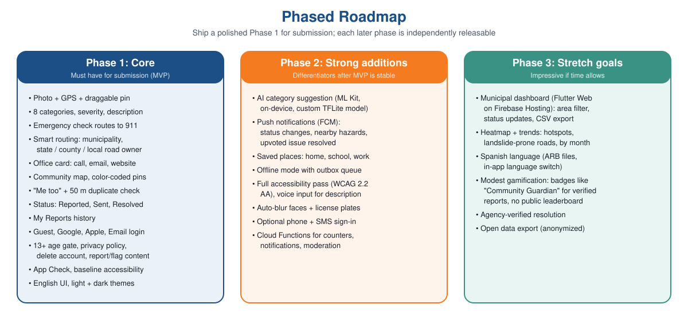
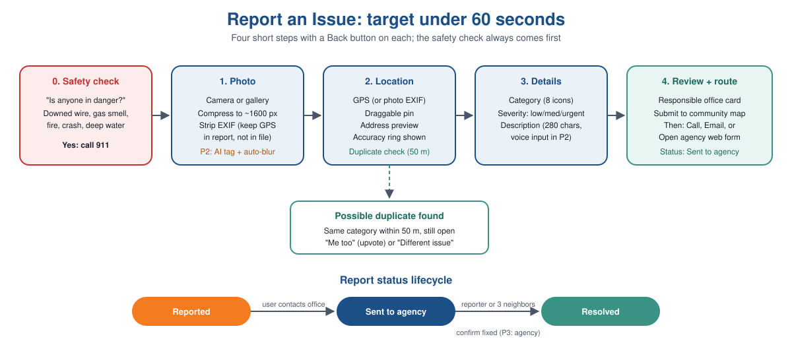
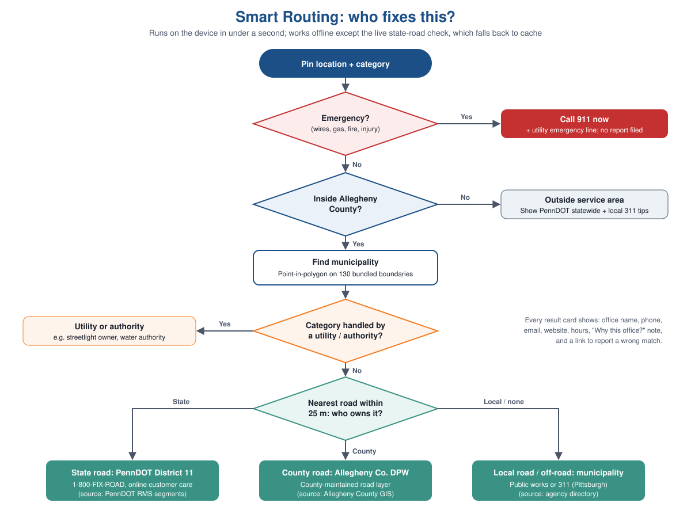
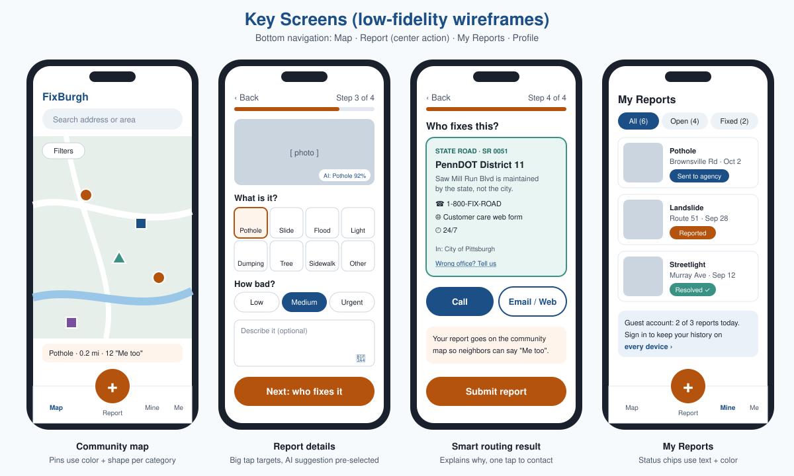
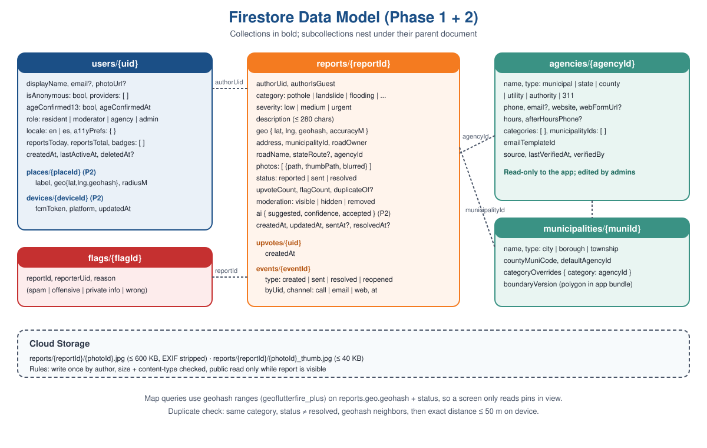
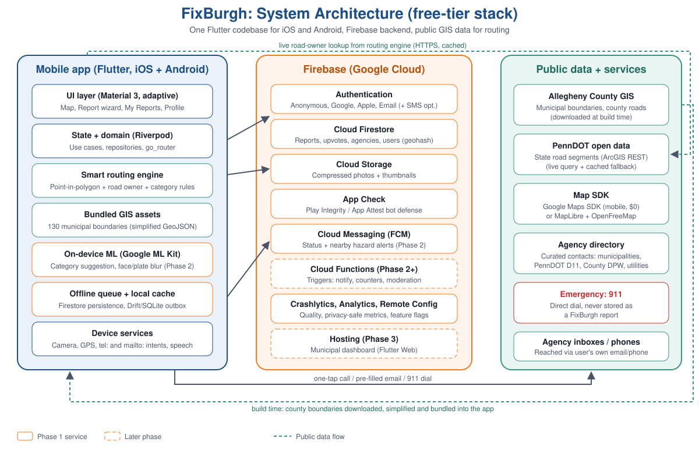

<p align="center"></p>

# FixBurgh: Business Requirements Document

| Field | Value |
|---|---|
| Product | FixBurgh: snap, pin and route local infrastructure problems in Allegheny County, PA |
| Platforms | iOS and Android (one Flutter codebase); web dashboard in Phase 3 |
| Document version | 1.1 (stack confirmed: Flutter + Firebase Blaze + Google Maps) |
| Date | October 4, 2026 |
| Owner | Vivek Anand |
| Status | Draft for review |
| Scope of this document | Business and product requirements, recommended architecture and tech stack. No application code. |

---

## Table of contents

1. [Executive summary](#1-executive-summary)
2. [Problem statement and opportunity](#2-problem-statement-and-opportunity)
3. [Vision, goals and non-goals](#3-vision-goals-and-non-goals)
4. [Stakeholders and personas](#4-stakeholders-and-personas)
5. [Scope by phase](#5-scope-by-phase)
6. [User journeys](#6-user-journeys)
7. [Functional requirements](#7-functional-requirements)
8. [Smart routing specification](#8-smart-routing-specification)
9. [Registration, login and account requirements](#9-registration-login-and-account-requirements)
10. [Non-functional requirements](#10-non-functional-requirements)
11. [UI/UX principles and design system](#11-uiux-principles-and-design-system)
12. [Accessibility requirements](#12-accessibility-requirements)
13. [Privacy, safety, legal and app store compliance](#13-privacy-safety-legal-and-app-store-compliance)
14. [Data model](#14-data-model)
15. [Recommended architecture and free-tier tech stack](#15-recommended-architecture-and-free-tier-tech-stack)
16. [Engineering standards](#16-engineering-standards)
17. [Testing and quality strategy](#17-testing-and-quality-strategy)
18. [Success metrics and KPIs](#18-success-metrics-and-kpis)
19. [Risks, assumptions, dependencies and constraints](#19-risks-assumptions-dependencies-and-constraints)
20. [Release plan and milestones](#20-release-plan-and-milestones)
21. [Open questions and decisions needed](#21-open-questions-and-decisions-needed)
22. [Appendices](#22-appendices)

---

## 1. Executive summary

Residents of Pittsburgh and the rest of Allegheny County deal with potholes, landslides, flooded roads, dark streetlights, illegal dumping and broken sidewalks every day. The problem is rarely that nobody cares; it is that **nobody knows who to call**. Allegheny County has **130 municipalities**, and a single street can be maintained by PennDOT, by the County, or by the local city, borough or township. Reports go to the wrong office, get lost, or are never made.

**FixBurgh** is a free mobile app that lets anyone photograph a problem, drop a pin, and within seconds see **exactly which office is responsible**, with a one-tap call, a pre-filled email, or a link to the right web form. Every report also lands on a **shared community map**, where neighbors can say "Me too" instead of filing duplicates and can watch the issue move from *Reported* to *Sent to agency* to *Resolved*.

The standout feature is **smart routing**: an on-device lookup against Allegheny County's open municipal boundary data and PennDOT's state road data that answers "who fixes this?" correctly, explains why, and works even when the connection is weak.

The product is planned in three phases so a polished, reliable **Phase 1** can be submitted first, with AI tagging, notifications, offline mode and privacy blurring in **Phase 2**, and a municipal dashboard, trends, Spanish and modest gamification in **Phase 3**. The recommended stack uses only free tiers: **Flutter + Firebase**, **Google ML Kit (on-device)**, **Google Maps SDK for mobile** (no per-load charge) or **MapLibre + OpenFreeMap**, and **public GIS data**.



---

## 2. Problem statement and opportunity

### 2.1 The problem

| Pain point | What happens today | Consequence |
|---|---|---|
| Fragmented jurisdiction | 130 municipalities plus PennDOT and County roads; ownership changes block by block | Residents call the wrong office, give up, or post on social media where nobody acts |
| Hard to describe location | "The big pothole past the bridge on the hill" | Crews cannot find the problem; reports bounce back |
| Duplicate reports | Ten people report the same landslide separately, or nobody does because they assume someone else did | Agency inboxes clog, or urgent issues go unreported |
| No feedback loop | Residents never learn if a report was received or fixed | Trust erodes and people stop reporting |
| Dangerous issues filed as tickets | Downed wires or gas smells are typed into a web form | Life-safety delays |
| Topography | Pittsburgh's hills, hollows and river valleys create cellular dead zones and are prone to landslides and flash flooding | Reports fail to send at the very spot of the problem |

### 2.2 Why existing tools fall short

- **City-specific 311 apps** (for example, the City of Pittsburgh's 311 service) only cover their own municipality. A resident in one of the other 129 municipalities, or on a state road inside the city, still needs to know who to call.
- **National apps** (SeeClickFix, FixMyStreet-style tools) depend on each municipality opting in and paying, so coverage in smaller boroughs and townships is uneven.
- **PennDOT's own reporting channels** handle only state roads, and residents usually cannot tell which roads are state-owned.

### 2.3 Opportunity

A free, county-wide app that solves the routing question for **every** location in Allegheny County, with no municipal sign-up required, fills a real gap. It also produces something no single office has: a public, deduplicated map of where problems cluster, which is valuable to residents, journalists, community groups and officials.

---

## 3. Vision, goals and non-goals

### 3.1 Vision statement

> *Every resident of Allegheny County can report a local problem in under a minute and know it reached the people who can fix it.*

### 3.2 Product principles

1. **Right office, first time.** Routing accuracy is the core promise; when unsure, the app says so and explains.
2. **Faster than a phone call.** A report takes under 60 seconds and three to four taps after the photo.
3. **Safety before tickets.** Anything that could hurt someone goes to 911, not to a queue.
4. **Community over duplicates.** "Me too" is easier than a new report.
5. **Private by default.** Minimal data, no ads, no selling data, blurred faces and plates.
6. **Works on a hillside.** Offline-tolerant, fast on mid-range phones, large touch targets.
7. **For everyone.** Accessible to screen-reader users, older residents and Spanish speakers.

### 3.3 Business goals

| ID | Goal | Measure (see Section 18) |
|---|---|---|
| G1 | Deliver a working, polished Phase 1 for competition submission | All Phase 1 "Must" requirements pass acceptance tests |
| G2 | Route reports to the correct office | ≥ 95% routing accuracy on a 100-point test set |
| G3 | Make reporting effortless | Median time from opening the report flow to submit ≤ 60 s |
| G4 | Reduce duplicate reports | ≥ 30% of would-be duplicates become "Me too" upvotes |
| G5 | Operate at zero recurring cost | $0/month cloud bill within free-tier quotas through the pilot |
| G6 | Be safe and compliant | Zero app store rejections for privacy, UGC or login policy |

### 3.4 Non-goals (explicitly out of scope)

- FixBurgh **is not an emergency service** and never replaces 911.
- FixBurgh **does not guarantee** that an agency will act; it gets the report to the right place and tracks community-visible status.
- No direct integration into agency work-order systems in Phases 1 and 2 (possible future work).
- No coverage outside Allegheny County in Phases 1 to 3 (users outside see general guidance).
- No advertising, no data sales, no paid tiers.

---

## 4. Stakeholders and personas

### 4.1 Stakeholders

| Stakeholder | Interest | Involvement |
|---|---|---|
| Residents and commuters | Fast reporting, visible progress | Primary users |
| Municipal public works / borough managers | Accurate, located, deduplicated reports | Recipients; Phase 3 dashboard users |
| PennDOT District 11 (Allegheny, Beaver, Lawrence counties) | State road issues routed correctly | Recipient |
| Allegheny County Department of Public Works | County-maintained roads and bridges | Recipient |
| Utilities and authorities (electric, water and sewer, gas) | Streetlights, drains, utility hazards | Recipients for specific categories |
| Competition judges | Working app, clear value, technical quality | Evaluators |
| Project team | Achievable scope, free tools | Builders |

### 4.2 Personas

**Persona 1: Maria, 34, commuter in Brookline**
- Drives Route 51 daily; hits the same pothole twice a week.
- Has no idea whether Route 51 is the City's or the State's problem.
- *Needs:* one-handed reporting at a red light is unsafe, so she reports from a parking lot in under a minute; wants to know when it is fixed.
- *Success for Maria:* the app tells her Route 51 is a PennDOT road and gives her a one-tap call to 1-800-FIX-ROAD.

**Persona 2: Walt, 71, retired, lives in a small borough**
- Uses a large-text phone setting; does not like creating accounts.
- Noticed a tree leaning on a power line after a storm.
- *Needs:* large buttons, plain language, no sign-up, and clear direction when something is dangerous.
- *Success for Walt:* the safety check tells him to call 911 and the electric utility, with buttons to do both.

**Persona 3: Aisha, 16, high school student and volunteer**
- Organizes neighborhood cleanups; wants to document illegal dumping in a hillside lot.
- *Needs:* fast photo capture, a map of reports to show her council member, and a sense of contribution.
- *Success for Aisha:* she can show a map of six dumping reports near her school and earn a modest "Community Guardian" badge (Phase 3).

**Persona 4: Dan, 45, borough public works manager**
- Gets vague phone calls with no location; often the problem is not even his borough's road.
- *Needs:* precise pins, photos, and fewer misrouted calls.
- *Success for Dan:* emails from FixBurgh include a map link, coordinates, photo and category, and state-road issues no longer reach him (Phase 3: he sees his area on a dashboard).

**Persona 5: Luis, 29, Spanish-speaking resident in Beechview**
- More comfortable in Spanish; uses a screen reader due to low vision.
- *Needs:* Spanish UI (Phase 3), full screen-reader support (Phase 2), voice input.

---

## 5. Scope by phase

Priority uses **MoSCoW**: **M**ust, **S**hould, **C**ould, **W**on't (this release).

### 5.1 Phase 1: Core (must have for submission)

| Area | Capability | Priority |
|---|---|---|
| Reporting | Take a photo or pick from gallery; GPS captured automatically; draggable pin to adjust | M |
| Reporting | Category: pothole, landslide, flooding or blocked drain, streetlight, illegal dumping, fallen tree, sidewalk damage, other | M |
| Reporting | Short description (optional, max 280 characters) and severity (low, medium, urgent) | M |
| Safety | "Is anyone in danger?" check that routes urgent hazards (downed wires, gas leaks, fire, crashes, people trapped, deep water on a road) to 911 instead of filing a report | M |
| Smart routing | Municipality lookup from Allegheny County open GIS boundary data | M |
| Smart routing | State (PennDOT) versus County versus local road ownership | M |
| Smart routing | Responsible office card: name, phone, email, website, hours; pre-filled email and one-tap call | M |
| Community map | All visible reports as pins color-coded (and shape-coded) by category | M |
| Community map | "Me too" upvote; duplicate warning within ~50 m for same open category | M |
| Community map | Status per report: Reported, Sent to agency, Resolved | M |
| My Reports | History of the user's submissions; mark resolved | M |
| Accounts | Guest mode (limited reports/day), Sign in with Google, Sign in with Apple, Email + password; guest-to-account upgrade without losing reports | M |
| Safeguards | Firebase App Check, 13+ age confirmation, privacy policy, in-app "Delete my account" | M |
| Safety | Flag/report objectionable content; basic moderation | M |
| Platform | Light and dark theme; baseline accessibility (labels, contrast, text scaling) | M |
| Platform | Crash reporting and privacy-safe analytics | S |

### 5.2 Phase 2: Strong additions

| Capability | Priority |
|---|---|
| AI photo tagging: on-device category suggestion (Google ML Kit, custom TensorFlow Lite model) | S |
| Push notifications: status changes, new hazards near saved places, upvoted issue resolved | S |
| Saved places: home, school, work, with alert radius | S |
| Offline mode: outbox queue; reports send automatically when connection returns | S |
| Full accessibility pass to WCAG 2.2 AA, voice input for descriptions | S |
| Privacy protection: automatic face and license-plate blurring before upload | S |
| Optional phone number + SMS code sign-in | C |
| Server-side triggers (Cloud Functions) for counters, notifications, moderation | S |

### 5.3 Phase 3: Stretch goals

| Capability | Priority |
|---|---|
| Municipal dashboard (web): reports in the borough's area, filters, status updates, CSV export | C |
| Heatmap and trends: hotspots, landslide-prone roads, monthly charts | C |
| Spanish language support | C |
| Modest gamification: badges such as "Community Guardian" for verified reports; no public leaderboard | C |
| Agency-verified resolution | C |
| Anonymized open-data export | C |

### 5.4 Out of scope for all three phases (Won't)

- Integration with agency work-order or 311 back-end systems.
- Payment, donations or in-app purchases.
- Coverage outside Allegheny County.
- Chat between residents.
- Video uploads (photos only, up to 3 per report).

---

## 6. User journeys

### 6.1 Report an issue (primary journey)



1. User taps the center **Report** button.
2. **Safety check** (always first, one screen): "Is anyone in danger right now?" with examples (downed power line, gas smell, fire, crash, someone trapped, car in deep water).
   - **Yes** shows a full-screen card with **Call 911** and, when relevant, the utility's emergency number. No report is stored.
   - **No / not sure it's dangerous** continues.
3. **Photo**: camera opens by default; gallery is one tap away. Up to 3 photos. The app compresses each photo and strips metadata from the file.
4. **Location**: map centered on GPS (or the photo's embedded location if picked from gallery and the user allows it), with an accuracy ring and a draggable pin. Address preview updates as the pin moves. If a similar open report exists within ~50 m, the app shows it and offers **Me too**.
5. **Details**: category grid (8 large icons, AI suggestion pre-selected in Phase 2), severity chips, optional description with voice input (Phase 2).
6. **Review and route**: responsible office card with an explanation ("Route 51 is a state road maintained by PennDOT"). User taps **Submit report**, then chooses **Call**, **Email** or **Open web form**. Status becomes *Sent to agency* when the user completes one of those actions.
7. Confirmation screen with share link and "Track in My Reports".

### 6.2 Me too (duplicate avoidance)

1. While browsing the map or during step 4 above, user sees a nearby open report of the same category.
2. User taps **Me too**. Upvote count increases; the user is subscribed to updates (Phase 2).
3. The user may optionally add one more photo if the situation changed (for example, the pothole got bigger), stored as an update on the same report.

### 6.3 Resolve a report

1. Reporter opens a report in **My Reports** and taps **Mark as fixed**, optionally attaching an "after" photo.
2. Alternatively, when three different signed-in users tap **Looks fixed** on a report, it becomes *Resolved (community confirmed)*.
3. In Phase 3, a verified agency user can resolve it from the dashboard (*Resolved (agency confirmed)*).
4. A resolved report can be **reopened** by the reporter within 30 days if the fix failed.

### 6.4 Guest to full account

1. Guest files up to the daily guest limit (default 3 per day).
2. App prompts "Save your reports and get updates: sign in". Linking a Google, Apple or email credential to the anonymous account keeps all reports.

### 6.5 Delete my account

1. Profile, then **Delete my account**, then confirm (re-authentication if required).
2. Personal data and the account are deleted. Reports are either deleted or kept **anonymized** on the map, depending on the user's choice on the confirmation screen (default: anonymize, because the issue still exists in the world).

---

## 7. Functional requirements

Each requirement has an ID, priority, phase and acceptance criteria. "The app" refers to the iOS and Android mobile apps.

### 7.1 Reporting (REP)

| ID | Requirement | Priority / Phase | Acceptance criteria |
|---|---|---|---|
| FR-REP-01 | The app shall let users capture a photo with the device camera inside the report flow. | M / P1 | Camera opens within 1 s of tapping Report on a mid-range device; photo preview shown. |
| FR-REP-02 | The app shall let users choose photos from the gallery using the system photo picker. | M / P1 | Android uses the system Photo Picker (no broad media permission); iOS uses PHPicker. |
| FR-REP-03 | The app shall support 1 to 3 photos per report. | M / P1 | Fourth photo is blocked with a clear message. |
| FR-REP-04 | The app shall resize photos to a maximum 1600 px long edge and JPEG quality ~80, and generate a ≤ 320 px thumbnail. | M / P1 | Uploaded file ≤ 600 KB; thumbnail ≤ 40 KB. |
| FR-REP-05 | The app shall strip EXIF and other metadata from the uploaded image file. | M / P1 | Downloaded image contains no GPS, device or timestamp EXIF tags. |
| FR-REP-06 | The app shall capture the device's GPS location with accuracy when the report starts, asking for "while using the app" permission only. | M / P1 | Location shown with accuracy ring; no background location permission is requested. |
| FR-REP-07 | The app shall let users drag a pin to adjust the location and show a reverse-geocoded address. | M / P1 | Pin moves smoothly; address updates within 1 s of release when online. |
| FR-REP-08 | The app shall allow manual location entry by search or by dragging when GPS is denied or unavailable. | M / P1 | Report can be completed with location permission denied. |
| FR-REP-09 | The app shall require one category from: pothole, landslide, flooding or blocked drain, streetlight, illegal dumping, fallen tree, sidewalk damage, other. | M / P1 | Submit disabled until a category is chosen. |
| FR-REP-10 | The app shall require severity: low, medium (default), urgent. | M / P1 | Severity stored on report; urgent shown with an icon on the map. |
| FR-REP-11 | The app shall accept an optional description up to 280 characters with a live counter. | M / P1 | Over-limit input is blocked. |
| FR-REP-12 | The app shall show a review screen summarizing photo, location, category, severity, description and responsible office before submission. | M / P1 | Each item has an Edit link back to its step. |
| FR-REP-13 | The app shall keep in-progress report data if the user leaves the app and returns within 24 hours. | S / P1 | Draft restored after app is backgrounded or killed. |
| FR-REP-14 | The app shall support voice input for the description using the platform speech recognizer. | S / P2 | Microphone button in description field; works with system dictation. |
| FR-REP-15 | Reporters may add an "update" photo or note to their own report. | C / P2 | Updates appear in report timeline. |

### 7.2 Safety and emergencies (SAF)

| ID | Requirement | Priority / Phase | Acceptance criteria |
|---|---|---|---|
| FR-SAF-01 | The report flow shall start with "Is anyone in danger right now?" listing examples: downed or sparking wires, gas smell, fire, vehicle crash, someone trapped or injured, water over a road deeper than a car's wheels. | M / P1 | Screen cannot be skipped on a user's first 3 reports; afterwards it is a single compact row that is still always shown. |
| FR-SAF-02 | Choosing "Yes" shall show a full-screen emergency card with a **Call 911** button and, for wires or gas, a secondary button for the relevant utility's emergency line. | M / P1 | No report is created; tapping Call opens the dialer with 911 pre-filled. |
| FR-SAF-03 | If a user picks "urgent" severity with category "fallen tree", "flooding" or "streetlight" and types keywords such as "wire", "sparking", "gas", "trapped", the app shall re-prompt the safety check. | S / P1 | Keyword list configurable via Remote Config. |
| FR-SAF-04 | Every report screen and the About screen shall display: "FixBurgh is not monitored for emergencies. Call 911." | M / P1 | Text visible and readable by screen reader. |

### 7.3 Smart routing (RTE)

Detailed logic is in [Section 8](#8-smart-routing-specification).

| ID | Requirement | Priority / Phase | Acceptance criteria |
|---|---|---|---|
| FR-RTE-01 | The app shall determine the municipality containing the pin using Allegheny County's municipal boundary data bundled in the app. | M / P1 | Correct for 100% of a 100-point test set of interior points; boundary points within 10 m may show "near a border" note. |
| FR-RTE-02 | The app shall detect when a pin is outside Allegheny County and show general guidance instead of a routed office. | M / P1 | Points in neighboring counties return "Outside service area". |
| FR-RTE-03 | The app shall determine whether the nearest road within 25 m is state-owned (PennDOT), County-maintained or local. | M / P1 | ≥ 95% correct on the routing test set. |
| FR-RTE-04 | The app shall apply category rules (for example, streetlights and drains may belong to a utility or authority) before road-owner rules. | M / P1 | Matrix in Appendix A applied; unit tests per row. |
| FR-RTE-05 | The app shall show the responsible office: name, phone, email (if published), website, web form link (if any), hours, and a one-sentence "Why this office?" explanation. | M / P1 | All fields present for every agency record or gracefully hidden if absent. |
| FR-RTE-06 | One-tap **Call** shall open the dialer with the number pre-filled. | M / P1 | Uses `tel:` intent; never auto-dials. |
| FR-RTE-07 | **Email** shall open the user's mail app with a pre-filled subject and body including category, severity, description, address, coordinates, a map link and a public photo link. | M / P1 | Uses `mailto:`; template in Appendix B; user reviews before sending. |
| FR-RTE-08 | **Open web form** shall open the agency's official online form in an in-app browser tab, with a "Copy report details" button. | M / P1 | Clipboard contains formatted details. |
| FR-RTE-09 | The app shall let users flag a wrong routing result ("Wrong office? Tell us"). | M / P1 | Creates a `flags` record with reason `wrong_routing`. |
| FR-RTE-10 | Agency contact data shall be stored server-side and cached on device, so contacts can be corrected without an app release. | M / P1 | Updating an agency record in Firestore changes the card on next app launch. |
| FR-RTE-11 | Routing shall complete in under 1 second online (p90) and work offline for municipality and cached road ownership. | S / P1 (offline P2) | Measured in performance tests. |

### 7.4 Community map (MAP)

| ID | Requirement | Priority / Phase | Acceptance criteria |
|---|---|---|---|
| FR-MAP-01 | The app shall show visible reports as pins on an interactive map, centered on the user's location (or downtown Pittsburgh if permission is denied). | M / P1 | Pins load within 2 s on 4G for the visible area. |
| FR-MAP-02 | Pins shall be color-coded **and** shape/icon-coded by category so color is never the only cue. | M / P1 | Legend available; passes color-blind simulation check. |
| FR-MAP-03 | Pins shall cluster when zoomed out. | S / P1 | No more than ~100 individual markers rendered at once. |
| FR-MAP-04 | The map shall query only the visible region (geohash range queries) and cap results. | M / P1 | Max 200 documents per viewport query. |
| FR-MAP-05 | Users shall filter by category, status (default: open only) and time range (default: last 90 days). | S / P1 | Filters persist per session. |
| FR-MAP-06 | Tapping a pin shall show a bottom sheet with thumbnail, category, severity, status, age, upvote count, responsible office and a **Me too** button. | M / P1 | Bottom sheet accessible with screen reader. |
| FR-MAP-07 | Signed-in and guest users may upvote ("Me too") once per report. | M / P1 | Second tap removes the upvote; count updates for others within 5 s. |
| FR-MAP-08 | When creating a report, the app shall search for open reports of the same category within 50 m and offer **Me too** or **This is different**. | M / P1 | Detected in ≥ 90% of seeded duplicate tests. |
| FR-MAP-09 | Each report shall carry a status: Reported, Sent to agency, Resolved, with a timestamped history. | M / P1 | History visible on report detail. |
| FR-MAP-10 | Resolved reports shall be hidden from the default map after 30 days but remain in My Reports. | S / P1 | Filter "Show resolved" reveals them. |
| FR-MAP-11 | Users shall be able to search an address or place to move the map. | S / P1 | Uses platform geocoder; no paid API calls. |

### 7.5 My Reports (MYR)

| ID | Requirement | Priority / Phase | Acceptance criteria |
|---|---|---|---|
| FR-MYR-01 | Users shall see a list of their reports, newest first, with thumbnail, category, address, date and status chip. | M / P1 | Tabs: All, Open, Fixed. |
| FR-MYR-02 | Users shall mark their own report resolved, optionally with an "after" photo. | M / P1 | Status changes to Resolved and history records it. |
| FR-MYR-03 | Users shall re-open their resolved report within 30 days. | S / P1 | Status returns to previous open status. |
| FR-MYR-04 | Users shall delete their own report. | M / P1 | Report and photos removed; upvotes on it discarded. |
| FR-MYR-05 | Users shall re-contact the responsible office from the report detail. | S / P1 | Same Call / Email / Web buttons. |
| FR-MYR-06 | Three distinct users tapping "Looks fixed" shall mark a report "Resolved (community confirmed)". | S / P1 | Threshold configurable via Remote Config. |

### 7.6 Notifications and saved places (NTF) — Phase 2

| ID | Requirement | Priority / Phase | Acceptance criteria |
|---|---|---|---|
| FR-NTF-01 | Users shall opt in to push notifications after their first report (not on first launch). | S / P2 | Permission rationale screen shown before system prompt. |
| FR-NTF-02 | Notify reporter and upvoters when a report's status changes. | S / P2 | Delivered within 1 minute of change. |
| FR-NTF-03 | Users shall save up to 3 places (home, school, work, or custom) with an alert radius of 0.25 to 2 miles. | S / P2 | Stored as coordinates and geohash only. |
| FR-NTF-04 | Notify users of new **urgent** reports inside a saved-place radius. | S / P2 | Server-side match on saved places; no background location tracking. |
| FR-NTF-05 | Users shall control each notification type and set quiet hours. | S / P2 | Settings screen toggles. |
| FR-NTF-06 | Notifications shall be rate limited to a maximum of 5 per user per day. | M / P2 | Enforced server-side. |

### 7.7 AI and privacy processing (AIP) — Phase 2

| ID | Requirement | Priority / Phase | Acceptance criteria |
|---|---|---|---|
| FR-AIP-01 | After a photo is taken, the app shall suggest a category on-device and pre-select it if confidence ≥ 0.6, showing "Suggested". | S / P2 | User can change it with one tap; no image leaves the device for classification. |
| FR-AIP-02 | The suggestion model shall be a custom TensorFlow Lite image classifier for the 8 categories, run through ML Kit's custom model API. | S / P2 | Top-1 accuracy ≥ 80% on a held-out test set of local photos. |
| FR-AIP-03 | The app shall detect faces (ML Kit Face Detection) and blur them before upload. | S / P2 | ≥ 95% of clearly visible frontal faces blurred in test set. |
| FR-AIP-04 | The app shall detect license plates (custom object detection model or text recognition heuristics) and blur them before upload. | S / P2 | ≥ 85% of legible plates blurred in test set; user can add manual blur boxes. |
| FR-AIP-05 | The user shall preview blurred photos and can tap to add or remove blur regions before upload. | S / P2 | Original unblurred image never uploaded. |
| FR-AIP-06 | The app shall log (anonymously) whether the AI suggestion was accepted, to measure model quality. | C / P2 | Stored in `reports.ai.accepted`. |

### 7.8 Offline mode (OFF) — Phase 2

| ID | Requirement | Priority / Phase | Acceptance criteria |
|---|---|---|---|
| FR-OFF-01 | Reports created offline shall be saved to a local outbox with photos and metadata. | S / P2 | Report survives app restart. |
| FR-OFF-02 | The outbox shall upload automatically when connectivity returns, with retry and exponential backoff. | S / P2 | Uses background work APIs on both platforms. |
| FR-OFF-03 | The UI shall show a "Waiting to send" state and allow cancel. | S / P2 | Clear status in My Reports. |
| FR-OFF-04 | Municipality lookup and the last-synced agency directory shall work offline. | S / P2 | Routing card shown offline with "road ownership will be confirmed when online" if needed. |
| FR-OFF-05 | The duplicate check shall run when the report syncs; if a duplicate is found, the user is notified and offered to merge as Me too. | C / P2 | Notification or in-app banner. |

### 7.9 Moderation and content safety (MOD)

| ID | Requirement | Priority / Phase | Acceptance criteria |
|---|---|---|---|
| FR-MOD-01 | Any user shall be able to flag a report as spam, offensive, private information, or wrong location/category. | M / P1 | Flag stored; user sees thanks message. |
| FR-MOD-02 | A report with 3 or more flags shall be hidden from the public map pending review. | M / P1 | Threshold configurable. |
| FR-MOD-03 | Moderators (role in user profile) shall restore or remove reports and block abusive accounts. | M / P1 | Phase 1 via Firebase console or simple admin screen; Phase 3 via dashboard. |
| FR-MOD-04 | Descriptions shall be filtered for profanity and personal data patterns (phone numbers, emails) before display. | S / P1 | On-device filter list; matching text masked on map. |
| FR-MOD-05 | Users shall be able to block another user's content from their own view. | M / P1 | Required by app store UGC rules. |
| FR-MOD-06 | Rate limits: guests 3 reports/day, signed-in users 10 reports/day, 30 upvotes/day. | M / P1 | Enforced by security rules and counters. |

### 7.10 Profile and settings (PRF)

| ID | Requirement | Priority / Phase | Acceptance criteria |
|---|---|---|---|
| FR-PRF-01 | Profile shows name (optional), sign-in method, report counts and (Phase 3) badges. | M / P1 | |
| FR-PRF-02 | Settings: theme (system, light, dark), text size preview, language (Phase 3), notifications (Phase 2), saved places (Phase 2). | M / P1 | |
| FR-PRF-03 | Links to privacy policy, terms of use, open-source licenses, data sources and attributions, and contact/support email. | M / P1 | Reachable in ≤ 2 taps. |
| FR-PRF-04 | **Delete my account** in-app, with confirmation and choice to delete or anonymize reports. | M / P1 | Completes within 30 s; also available via a public web page for Google Play. |
| FR-PRF-05 | **Download my data** as a JSON file. | C / P2 | |

### 7.11 Phase 3 features

| ID | Requirement | Priority / Phase | Acceptance criteria |
|---|---|---|---|
| FR-DSH-01 | A web dashboard shall let verified municipal users see reports inside their municipality boundary. | C / P3 | Access granted by admin; role `agency` with `municipalityIds`. |
| FR-DSH-02 | Dashboard users shall filter by category, status, date and severity, and export CSV. | C / P3 | |
| FR-DSH-03 | Dashboard users shall set status (acknowledged, scheduled, resolved) and post a public note. | C / P3 | Reporter and upvoters notified. |
| FR-TRD-01 | A heatmap layer and trend charts (by category, month, municipality) shall be available in-app and on the dashboard. | C / P3 | Aggregates precomputed daily to stay inside free quotas. |
| FR-I18N-01 | All UI strings shall be externalized; Spanish translation provided and reviewed by a native speaker. | C / P3 | Language follows device setting with in-app override. |
| FR-GAM-01 | Badges: "First Report", "Community Guardian" (5 reports that reached Resolved), "Good Neighbor" (10 helpful Me too). No points for volume alone, no public leaderboard. | C / P3 | Badges only for resolved or confirmed reports to discourage spam. |

---

## 8. Smart routing specification

Smart routing is FixBurgh's differentiator. It answers **"who fixes this?"** for any point in Allegheny County.



### 8.1 Data sources

| Data | Source | How FixBurgh uses it | Refresh |
|---|---|---|---|
| Municipal boundaries (130 municipalities) | Allegheny County GIS Open Data portal and the Western Pennsylvania Regional Data Center (WPRDC), "Allegheny County Municipal Boundaries" | Downloaded at build time, simplified (Douglas-Peucker, ~5 m tolerance), bundled in the app as GeoJSON (target ≤ 1.5 MB) | Each app release; version stored in Remote Config |
| Allegheny County boundary | Same dataset (union of municipalities) | Outside-county check | Each release |
| State-owned roads | PennDOT open data (PennShare portal): Roadway Management System (RMS) state road segments, published as ArcGIS feature services | Live spatial query of segments within 25 m of the pin; results cached by geohash; in Phase 2 a clipped Allegheny County extract is bundled for offline use | Live query; bundled extract refreshed each release |
| County-maintained roads | Allegheny County GIS road centerlines / County road inventory (to be confirmed during the data spike) | Distinguish County roads from local roads | Each release |
| Local road centerlines (fallback) | Allegheny County street centerlines or OpenStreetMap | Confirm a road exists near the pin; road name for the email | Each release |
| Agency directory | Curated by the team from official municipal, County, PennDOT and utility websites | Office card contacts | Verified quarterly; `lastVerifiedAt` on each record |

> **Data spike (first engineering task):** confirm the exact service URLs, field names (for example, the field that identifies state route numbers and the field identifying County ownership), licensing and attribution text for each dataset, and record them in a `docs/data-sources.md` file in the code repository. All datasets above are public; the team must comply with each portal's terms and show attribution in the app's Data Sources screen.

### 8.2 Algorithm

```
Input: pin (lat, lng), category, severity, isEmergency

1. If isEmergency → EMERGENCY result (911 + utility emergency line). Stop.
2. If pin not inside Allegheny County polygon → OUTSIDE result. Stop.
3. municipality = point-in-polygon(pin, bundled boundaries)
     - Use an R-tree / bounding-box index for speed (< 20 ms).
     - If pin is within 10 m of a boundary line, set nearBorder = true.
4. categoryRule = lookup(categoryRules, category, municipality)
     - e.g. streetlight in a municipality whose lights are utility-owned → UTILITY result
     - e.g. blocked drain in a municipality served by a water/sewer authority → AUTHORITY result
     - If categoryRule says "always municipality" (illegal dumping, sidewalk) → skip road owner check
   If a categoryRule result exists → return it (with municipality context).
5. roadOwner = nearestRoadOwner(pin, radius = 25 m)
     a. Query PennDOT state road segments within 25 m (live, cached by geohash-7).
     b. If none, check County-maintained road layer.
     c. If none, LOCAL.
     d. If the live query fails and no cache → assume LOCAL but mark confidence = "low"
        and show "This might be a state road; if the municipality says so, call PennDOT".
6. agency = resolveAgency(roadOwner, municipality, category)
7. Return RoutingResult { agency, municipality, roadOwner, roadName, stateRoute,
                          confidence (high | medium | low), explanation, nearBorder }
```

**Explanation strings** (examples, all localized):
- "Route 51 (Saw Mill Run Blvd) is a state road. PennDOT District 11 maintains it, even inside the City of Pittsburgh."
- "This street is maintained by the Borough of Dormont."
- "Streetlights here are owned by the electric utility, so the utility repairs them."
- "You're near the border of two municipalities. If this office says it isn't theirs, try *Neighboring municipality*." (shows second option)

### 8.3 Confidence and fallbacks

| Situation | Behavior |
|---|---|
| High confidence (inside one municipality, clear road owner) | Single office card |
| Near municipal border (≤ 10 m) | Primary office plus "Neighboring municipality" alternative |
| Pin is far (> 25 m) from any road | Treat as off-road (park, lot, hillside): municipality; for landslides, add PennDOT as alternate if a state road is within 100 m |
| PennDOT service unavailable and no cache | Municipality with low-confidence note and PennDOT as alternate |
| Category "other" | Municipality, with road-owner context shown |
| Outside Allegheny County | General guidance: PennDOT statewide line for state roads, advise contacting local municipality, no report routing (report can still be saved to the map only if within a 1 km buffer, otherwise blocked) |

### 8.4 Agency directory requirements

- Each of the 130 municipalities must have at least one verified contact (phone and website at minimum) before Phase 1 launch.
- PennDOT District 11, Allegheny County DPW, and the main utilities and water/sewer authorities serving the county must be present.
- The City of Pittsburgh routes to **Pittsburgh 311** (dial 311 inside the city, or 412-255-2621, plus its online request form).
- PennDOT state road maintenance routes to **1-800-FIX-ROAD (1-800-349-7623)** and PennDOT's online customer care center.
- Every agency record has `source` (URL where the contact was found) and `lastVerifiedAt`. Records older than 120 days appear in an admin "needs re-verification" list.
- Wrong-routing flags are reviewed weekly; corrections update Firestore (no app release needed).

> All phone numbers, emails and URLs must be re-verified against official sources when the directory is seeded. Numbers in this document are illustrative of the format and were correct to the author's knowledge at writing time.

### 8.5 Status "Sent to agency"

FixBurgh does not integrate with agency systems in Phases 1 and 2, so *Sent to agency* means **the reporter contacted the office through FixBurgh** (tapped Call, or returned from the email/web form and confirmed "I sent it"). The app records the channel (call, email, web) and time. This is honest, simple and verifiable, and avoids spamming agencies with automated emails.

---

## 9. Registration, login and account requirements

### 9.1 Methods

| Method | Phase | Notes |
|---|---|---|
| Guest (Firebase Anonymous Auth) | P1 | Default on first launch. Limited to 3 reports/day and cannot be notified across devices. Upgrade keeps all reports by linking credentials to the same user ID. |
| Sign in with Google | P1 | One tap on Android; available on iOS. |
| Sign in with Apple | P1 | Required on iOS by App Store rules when other third-party logins are offered; supports "Hide my email". Also offered on Android via web flow (optional). |
| Email + password | P1 | Email verification required before the account can upvote or receive notifications; password reset by email; minimum 8 characters with breach-resistant rules (Firebase password policy). |
| Phone + SMS code | P2, optional | Simple for older residents and spam-resistant, but SMS is billed per message; requires the Firebase Blaze (pay-as-you-go) plan. Off by default; enable via Remote Config only if budget allows. |

### 9.2 Account requirements

| ID | Requirement | Priority / Phase |
|---|---|---|
| FR-AUTH-01 | First launch shows a 3-screen onboarding (what FixBurgh does, privacy promise, age confirmation) and then the map as a guest. No forced sign-up. | M / P1 |
| FR-AUTH-02 | Neutral age screen ("Enter your birth year") before any data is collected. Under 13: the app explains it cannot be used and stores nothing. The screen does not hint at the required age. | M / P1 |
| FR-AUTH-03 | Guest-to-account linking preserves user ID, reports, upvotes. If the credential already belongs to another account, offer to merge guest reports into it. | M / P1 |
| FR-AUTH-04 | Sign-out clears local caches of personal data. | M / P1 |
| FR-AUTH-05 | Re-authentication is required for account deletion and email changes. | M / P1 |
| FR-AUTH-06 | Firebase App Check (Play Integrity on Android, App Attest / DeviceCheck on iOS) is enforced for Firestore, Storage and Functions. | M / P1 |
| FR-AUTH-07 | Suspicious activity (more than limits, many flags) temporarily restricts posting for that user ID and device. | S / P1 |
| FR-AUTH-08 | No CAPTCHA in the native app flow by default; App Check plus rate limits replace it. A reCAPTCHA Enterprise / App Check web provider is used on the Phase 3 dashboard. | S / P1 |

---

## 10. Non-functional requirements

### 10.1 Performance

| ID | Requirement | Target |
|---|---|---|
| NFR-PERF-01 | Cold start to interactive map | ≤ 2.5 s on a mid-range device (for example, a 3-year-old Android phone with 4 GB RAM) |
| NFR-PERF-02 | Report flow total time (median, measured in usability tests) | ≤ 60 s |
| NFR-PERF-03 | Routing result | ≤ 1 s p90 online; ≤ 200 ms for municipality offline |
| NFR-PERF-04 | Map viewport load | ≤ 2 s on 4G for ≤ 200 pins |
| NFR-PERF-05 | Photo upload (600 KB) | ≤ 5 s on 4G; progress indicator always visible |
| NFR-PERF-06 | Frame rendering | 60 fps scrolling and map panning; no jank frames > 16 ms in report flow during profiling |
| NFR-PERF-07 | App size | ≤ 40 MB download per platform for Phase 1 (bundled GIS data ≤ 3 MB) |

### 10.2 Reliability and availability

| ID | Requirement | Target |
|---|---|---|
| NFR-REL-01 | Crash-free sessions | ≥ 99.5% (Crashlytics) |
| NFR-REL-02 | No report data loss | 0 lost reports in offline/online toggle tests (Phase 2 outbox); Phase 1 retries upload and keeps the draft until success |
| NFR-REL-03 | Backend availability | Inherits Firebase SLA; app degrades gracefully (read-only cached map, drafts saved) |
| NFR-REL-04 | External GIS outage | Routing still returns a municipality result with a low-confidence note |

### 10.3 Security

| ID | Requirement |
|---|---|
| NFR-SEC-01 | Firestore and Storage Security Rules deny by default; users write only their own documents; field-level validation (types, enums, lengths, coordinates inside the county bounding box). |
| NFR-SEC-02 | App Check enforced on all Firebase products used. |
| NFR-SEC-03 | All traffic over TLS 1.2+. No secrets in the app binary beyond public Firebase config and restricted API keys (keys restricted by app package name / bundle ID and API). |
| NFR-SEC-04 | Agency and municipality collections are read-only to clients; writes only by admin role via console or Functions. |
| NFR-SEC-05 | Role changes (moderator, agency, admin) only via Firebase custom claims set from a trusted environment. |
| NFR-SEC-06 | Dependency scanning (Dependabot) and static analysis on every pull request. |
| NFR-SEC-07 | OWASP MASVS L1 checklist reviewed before each store release. |
| NFR-SEC-08 | Storage rules: max 2 MB per object, `image/jpeg` only, write-once, path must match an existing report owned by the user. |

### 10.4 Scalability and cost (free-tier budget)

| Resource | Free allowance (approx., verify on Firebase pricing page) | FixBurgh design to stay inside it |
|---|---|---|
| Firestore reads | 50,000 / day | Viewport queries capped at 200; clustering; 5-minute client cache; aggregated "map summary" docs for zoomed-out views (Phase 2) |
| Firestore writes | 20,000 / day | Upvotes as one doc per user per report; counters via batched writes |
| Firestore storage | 1 GiB | ~2 KB per report; 1 GiB ≈ hundreds of thousands of reports |
| Cloud Storage | ~5 GB stored (US regions, no-cost tier on Blaze) | ≤ 640 KB per photo incl. thumbnail ≈ 7,500+ photos; old resolved photos downscaled after 1 year |
| Cloud Storage download | ~100 GB / month (no-cost tier) | Map shows 40 KB thumbnails; full image only on tap |
| Cloud Functions | 2 M invocations / month (no-cost tier on Blaze) | Phase 2 triggers only |
| FCM | Free, no limit | |
| Authentication | Free for anonymous, email, Google, Apple | SMS optional |
| Hosting | 10 GB storage, ~360 MB/day transfer | Phase 3 dashboard |

> **Guardrail:** set a Google Cloud budget alert at $1 and $5, and a daily read alert. If usage approaches limits, Remote Config can reduce map page sizes and disable non-essential features.

### 10.5 Compatibility

| ID | Requirement |
|---|---|
| NFR-CMP-01 | iOS 15 or later (iPhone); iPad runs in compatibility layout. |
| NFR-CMP-02 | Android 8.0 (API 26) or later; target the current Google Play target API level requirement at submission time. |
| NFR-CMP-03 | Portrait-first; landscape supported on map and photo preview. |
| NFR-CMP-04 | Screen sizes from 4.7" to 6.9"; responsive layout for tablets in Phase 3. |

### 10.6 Maintainability and observability

- Feature-first modular code structure (Section 16) with ≥ 70% unit test coverage on domain and routing logic.
- Crashlytics, Firebase Performance Monitoring, and Analytics events limited to non-personal product metrics (Appendix D).
- Remote Config flags for every Phase 2 and 3 feature so features can be turned off without a release.

---

## 11. UI/UX principles and design system

### 11.1 Principles

1. **One primary action per screen.** Big bottom button, clear next step.
2. **Thumb-first layout.** Primary actions in the lower third; bottom navigation with a raised center **Report** button.
3. **Progressive disclosure.** Only photo, pin and category are required; everything else is optional or defaulted.
4. **Explain, don't just tell.** The routing card says *why* an office is responsible.
5. **Forgiving.** Every step has Back and Edit; drafts auto-save; undo for upvotes.
6. **Plain language.** Grade 6 reading level; no jargon like "jurisdiction" or "RMS segment".
7. **Honest status.** "Sent to agency" means you contacted them, and the app says so.
8. **Native feel on both platforms.** Material 3 on Android, Cupertino-adapted controls on iOS (date pickers, switches, back gestures, share sheet).
9. **Delight, lightly.** Small success animation on submit; avoid gamified pressure.

### 11.2 Information architecture

```
Bottom navigation
├── Map (home)
│   ├── Search, Filters, Legend
│   └── Report detail sheet → Me too / Looks fixed / Flag / Contact office
├── Report (center action)
│   └── Safety → Photo → Location → Details → Review + Route → Confirmation
├── My Reports
│   ├── All / Open / Fixed
│   └── Report detail → Mark fixed / Reopen / Delete / Contact office
└── Profile
    ├── Account (sign in / upgrade / sign out / delete)
    ├── Settings (theme, text, notifications P2, saved places P2, language P3)
    ├── Badges (P3)
    └── About (privacy, terms, data sources, licenses, contact, "Not for emergencies")
```

### 11.3 Key screens



### 11.4 Brand and design tokens

Colors are taken from the FixBurgh logo. Contrast ratios were computed against white (#FFFFFF) using the WCAG 2.x formula.

| Token | Hex | Use | Contrast on white |
|---|---|---|---|
| `brand.navy` (primary) | `#1B4F86` | Primary text accents, app bar, selected states | 8.37:1 (passes AA for all text) |
| `brand.orange` (accent) | `#F47B20` | Illustrations, icons ≥ 24 px on dark backgrounds, highlights | 2.73:1 (**do not use for text or as background for white text**) |
| `brand.orange700` (CTA) | `#B4530E` | Primary buttons with white text, FAB, "Reported" chip | 5.02:1 (passes AA) |
| `brand.teal` | `#3A9284` | Large surfaces, map accents, "Resolved" fill with dark text | 3.73:1 (large text and UI only) |
| `brand.teal700` | `#1F6B5F` | Teal text and "Resolved" chip with white text | 6.31:1 |
| `neutral.900` | `#1A202C` | Body text | 16.3:1 |
| `neutral.600` | `#4A5568` | Secondary text | 7.53:1 |
| `semantic.danger` | `#C53030` | Emergency card, destructive actions | 5.47:1 |

- **Dark theme:** generated with Material 3 `ColorScheme.fromSeed(seedColor: #1B4F86)` and manually adjusted; every text/background pair verified ≥ 4.5:1.
- **Typography:** system fonts (SF Pro on iOS, Roboto on Android) for performance and Dynamic Type support; Material 3 type scale; body minimum 16 sp.
- **Shape:** 12 to 16 px corner radius; pill-shaped primary buttons ≥ 48 dp tall.
- **Iconography:** Material Symbols (Apache 2.0, free) with category-specific icons; each category has a unique color **and** icon **and** marker shape.

### 11.5 Category visual language

| Category | Marker shape | Color | Icon (Material Symbols) |
|---|---|---|---|
| Pothole | Circle | Orange 700 | `road` / custom pothole |
| Landslide | Triangle | Brown `#8B5A2B` | `landslide` |
| Flooding / blocked drain | Drop | Blue `#2B6CB0` | `water_drop` |
| Streetlight | Square | Amber `#B7791F` | `light` |
| Illegal dumping | Diamond | Purple `#6B46C1` | `delete` |
| Fallen tree | Hexagon | Green `#2F855A` | `park` |
| Sidewalk damage | Rounded square | Navy `#1B4F86` | `directions_walk` |
| Other | Star | Gray `#4A5568` | `more_horiz` |

### 11.6 Microcopy examples

| Moment | Copy |
|---|---|
| Safety screen title | "First, is anyone in danger right now?" |
| Duplicate found | "Someone reported this 2 days ago. Add your voice?" with **Me too** / **This is different** |
| Routing card | "PennDOT fixes this one. Route 51 is a state road." |
| Guest limit reached | "You've sent 3 reports today. Sign in to send more and get updates." |
| Sent to agency | "Nice work. You told the right people." |

---

## 12. Accessibility requirements

Target: **WCAG 2.2 Level AA** for the mobile apps and dashboard, plus platform guidelines (Apple Human Interface Guidelines, Material accessibility). Phase 1 delivers the baseline; Phase 2 completes the full pass and audit.

| ID | Requirement | Phase |
|---|---|---|
| NFR-A11Y-01 | Every interactive element has a meaningful accessible label (Flutter `Semantics`), role and state; images of reports have alt text built from category + address. | P1 |
| NFR-A11Y-02 | Touch targets ≥ 48 × 48 dp (Android) / 44 × 44 pt (iOS). | P1 |
| NFR-A11Y-03 | Text contrast ≥ 4.5:1 (≥ 3:1 for large text and UI components), verified for light and dark themes. | P1 |
| NFR-A11Y-04 | Supports system text scaling up to 200% without truncating actions or overlapping content. | P1 |
| NFR-A11Y-05 | Color is never the only signal: categories use shape + icon; statuses use text labels. | P1 |
| NFR-A11Y-06 | Full VoiceOver (iOS) and TalkBack (Android) support with logical focus order; the map offers a **List view** alternative of nearby reports. | P2 |
| NFR-A11Y-07 | Pin placement is possible without dragging: "Use my location", address search, and arrow buttons to nudge the pin. | P2 |
| NFR-A11Y-08 | High-contrast mode toggle (and respects iOS "Increase Contrast" / Android high-contrast text). | P2 |
| NFR-A11Y-09 | Respects Reduce Motion; no essential information conveyed only by animation. | P1 |
| NFR-A11Y-10 | Voice input for description; all forms usable with external keyboard and Switch Control. | P2 |
| NFR-A11Y-11 | Error messages are announced to screen readers and explain how to fix the problem. | P1 |
| NFR-A11Y-12 | Accessibility audit with Android Accessibility Scanner, Xcode Accessibility Inspector, and at least 2 users who rely on assistive technology. | P2 |

---

## 13. Privacy, safety, legal and app store compliance

### 13.1 Privacy principles

- **Data minimization:** no real name required; no contacts, no background location, no advertising ID.
- **Purpose limitation:** data used only to show reports, route them, and notify users who opt in.
- **No sale or sharing** of personal data; no third-party ad SDKs.
- **Public by design, personal by exception:** reports (photo, location, category, description) are public; the reporter's identity is **not** shown on the map (displayed as "A neighbor").
- **Retention:** resolved reports' full-size photos are downscaled after 12 months; inactive guest accounts and their unlinked data are deleted after 12 months of inactivity; deleted accounts are purged within 30 days (including backups where applicable).

### 13.2 Data inventory

| Data | Collected | Purpose | Visibility | Store disclosure category |
|---|---|---|---|---|
| Photo(s) | Yes, user-provided | Show the issue | Public (blurred in P2) | Photos |
| Precise location of the issue | Yes, user-confirmed pin | Map and routing | Public | Precise location |
| Device location (live) | Only while app is in use | Center map, prefill pin | Not stored except as the confirmed pin | Precise location |
| Category, severity, description | Yes | Report content | Public | User content |
| Email, name (optional) | Only for non-guest sign-in | Account | Private | Contact info |
| Birth year | **Not stored**; only the result "13+ confirmed" and a timestamp | Age gate | Private | None |
| User ID, device push token | Yes | Account, notifications | Private | Identifiers |
| Saved places (P2) | Optional | Nearby alerts | Private | Precise location |
| Crash logs, product analytics | Yes, non-personal | Quality | Private | Diagnostics, app interactions |

### 13.3 COPPA and minors

- FixBurgh is a general-audience app **not directed to children under 13**.
- A **neutral age screen** (birth year, no default value, no hint) runs before any personal data is collected, in line with FTC COPPA guidance. Under-13 users cannot proceed and nothing is stored; the app does not allow immediately retrying with a different age on the same device session.
- Users aged 13 to 17 can use the app; the privacy policy uses plain language and the app avoids features that encourage oversharing (no public profiles, no direct messages, no public leaderboard).
- If the team learns an account belongs to a child under 13, the account and data are deleted promptly.

### 13.4 Emergency disclaimer and liability

- Persistent "Not for emergencies. Call 911." messaging (FR-SAF-04).
- Terms of use clarify that FixBurgh does not guarantee repairs, that agencies are independent, and that users must not report while driving or trespass to take photos.
- In-app safety tip on first report: "Only take photos when it's safe. Never stop in traffic."

### 13.5 Apple App Store requirements (checklist)

| Topic | Requirement | How FixBurgh complies |
|---|---|---|
| Login services (Guideline 4.8) | If third-party social login is offered, also offer an equivalent privacy-focused login option | Sign in with Apple offered alongside Google and email |
| Account deletion (5.1.1(v)) | Apps that support account creation must let users initiate deletion in-app | Profile → Delete my account |
| User-generated content (1.2) | Filter objectionable content, a way to report it, ability to block abusive users, published contact info | FR-MOD-01 to FR-MOD-06, support email in About |
| Privacy nutrition label | Accurate data disclosure | Based on table 13.2 |
| Privacy manifest | `PrivacyInfo.xcprivacy` for app and third-party SDKs, with required-reason APIs declared | Included; Firebase SDK manifests verified |
| Permission strings | Clear `NSCameraUsageDescription`, `NSLocationWhenInUseUsageDescription`, `NSPhotoLibraryUsageDescription` (if needed), `NSMicrophoneUsageDescription` / `NSSpeechRecognitionUsageDescription` (P2) | Plain-language purpose strings |
| Location | Request only "When In Use" | No background location |
| Emergency services | Don't misrepresent the app as an emergency service | Disclaimer and 911 routing |

### 13.6 Google Play requirements (checklist)

| Topic | Requirement | How FixBurgh complies |
|---|---|---|
| Data safety form | Accurate disclosure of collection and sharing | Based on table 13.2 |
| Account deletion | In-app deletion **and** a web link where users can request deletion without reinstalling | In-app flow plus a simple Firebase Hosting page |
| Photo and video permissions policy | Use the system Photo Picker instead of broad media permissions unless core | Photo Picker only |
| Location permissions | Foreground only; prominent disclosure before request | Rationale screen |
| Target API level | Meet the current target API level at submission | CI enforces `targetSdk` |
| UGC policy | In-app reporting, moderation, terms | FR-MOD series |
| Families policy | Not targeted at children; age screen in place | Target audience set to 13+ |

### 13.7 Content and photo safety

- Phase 1: users are reminded not to photograph people or plates; flagging handles mistakes.
- Phase 2: automatic face and plate blur on device before upload; original never leaves the device (FR-AIP-03 to 05).
- Photos showing private property interiors or people as the main subject can be flagged as "private information" and are hidden after review.

### 13.8 Licensing and attribution

- Show attribution for Allegheny County / WPRDC, PennDOT, map provider (Google or OpenStreetMap contributors / OpenFreeMap), and open-source licenses (Flutter `LicensePage`).
- Choose an open-source license for the code (recommendation: MIT or Apache 2.0) if the repository is public.

---

## 14. Data model



### 14.1 Collections

**`users/{uid}`**

| Field | Type | Notes |
|---|---|---|
| `displayName` | string? | Optional, never shown on public map |
| `email` | string? | From auth provider |
| `isAnonymous` | bool | Guest flag |
| `providers` | string[] | `anonymous`, `google.com`, `apple.com`, `password`, `phone` |
| `ageConfirmed13` | bool | Birth year not stored |
| `ageConfirmedAt` | timestamp | |
| `role` | enum | `resident` (default), `moderator`, `agency`, `admin` (mirrors custom claims) |
| `locale` | string | `en` (P1), `es` (P3) |
| `a11yPrefs` | map | High contrast, reduced motion overrides |
| `reportsToday`, `reportsTodayDate`, `reportsTotal` | int / date / int | Rate limiting and profile |
| `badges` | string[] | P3 |
| `blockedUids` | string[] | Users whose content is hidden for this user |
| `createdAt`, `lastActiveAt` | timestamp | |

Subcollections: `places/{placeId}` (P2), `devices/{deviceId}` (P2).

**`reports/{reportId}`**

| Field | Type | Notes |
|---|---|---|
| `authorUid` | string | Not exposed in public UI |
| `authorIsGuest` | bool | |
| `category` | enum | `pothole`, `landslide`, `flooding`, `streetlight`, `dumping`, `fallen_tree`, `sidewalk`, `other` |
| `severity` | enum | `low`, `medium`, `urgent` |
| `description` | string | ≤ 280 chars, filtered |
| `geo` | map | `lat`, `lng`, `geohash` (precision 9), `accuracyM` |
| `address` | string | Reverse geocoded, approximate |
| `municipalityId` | string | |
| `roadOwner` | enum | `state`, `county`, `local`, `none`, `unknown` |
| `roadName`, `stateRoute` | string? | |
| `agencyId` | string | Primary routed agency |
| `routingConfidence` | enum | `high`, `medium`, `low` |
| `photos` | array | `{path, thumbPath, width, height, blurred}` |
| `status` | enum | `reported`, `sent`, `resolved` |
| `resolvedBy` | enum? | `reporter`, `community`, `agency` |
| `upvoteCount`, `fixedVoteCount`, `flagCount` | int | |
| `duplicateOf` | string? | When merged |
| `moderation` | enum | `visible`, `hidden`, `removed` |
| `ai` | map? | `suggested`, `confidence`, `accepted` (P2) |
| `createdAt`, `updatedAt`, `sentAt`, `resolvedAt` | timestamp | |
| `clientVersion`, `source` | string | `online`, `offline_queue` |

Subcollections: `upvotes/{uid}`, `fixedVotes/{uid}`, `events/{eventId}` (status history: `type`, `byUid`, `channel`, `note`, `at`).

**`agencies/{agencyId}`**: `name`, `type` (`municipal`, `state`, `county`, `utility`, `authority`, `311`), `phone`, `afterHoursPhone`, `email`, `website`, `webFormUrl`, `hours`, `categories[]`, `municipalityIds[]`, `emailTemplateId`, `source`, `lastVerifiedAt`, `verifiedBy`.

**`municipalities/{muniId}`**: `name`, `type` (`city`, `borough`, `township`, `town`), `countyMuniCode`, `defaultAgencyId`, `categoryOverrides` (map of category to agencyId), `boundaryVersion`.

**`flags/{flagId}`**: `reportId`, `reporterUid`, `reason` (`spam`, `offensive`, `private_info`, `wrong_location`, `wrong_category`, `wrong_routing`), `note`, `createdAt`, `reviewedAt`, `outcome`.

**`config/app`** (or Remote Config): rate limits, thresholds, keyword lists, feature flags.

### 14.2 Indexes

- `reports`: (`geo.geohash` ASC, `moderation`, `status`) for viewport queries.
- `reports`: (`authorUid`, `createdAt` DESC) for My Reports.
- `reports`: (`municipalityId`, `status`, `createdAt` DESC) for the Phase 3 dashboard.
- `reports`: (`category`, `geo.geohash`) for the duplicate check.

### 14.3 Security rules outline (illustrative, not final code)

- `reports`: read if `moderation == 'visible'` or requester is author or moderator. Create if signed in (including anonymous), App Check valid, `authorUid == request.auth.uid`, required fields valid, coordinates inside county bounding box, and daily limit not exceeded. Update by author limited to `status`, `description`, `photos` (append); counters only by increments of ±1 tied to a matching `upvotes/{uid}` write.
- `upvotes/{uid}`: create/delete only where `uid == request.auth.uid`.
- `agencies`, `municipalities`, `config`: read all; write none (admin via console/Admin SDK).
- `flags`: create by signed-in users; read only by moderators.
- `users/{uid}`: read/write only by that user, except `role` and counters (server only).

---

## 15. Recommended architecture and free-tier tech stack



### 15.1 Stack decision summary

> **Confirmed stack (Oct 4, 2026):** Flutter + Firebase on the **Blaze plan** (staying inside the no-cost usage tier with budget alerts) + **Google Maps SDK** for mobile. The MapLibre and Supabase options below remain documented fallbacks only.

| Layer | Recommendation | Free tier / cost | Why | Alternatives considered |
|---|---|---|---|---|
| Cross-platform framework | **Flutter 3.x (Dart 3)** | Free, open source | One codebase for iOS, Android and the Phase 3 web dashboard; fast, consistent UI; first-class Firebase and ML Kit plugins; strong accessibility support | React Native (Expo): also excellent, but web dashboard and map/ML plugins are less uniform; Kotlin Multiplatform: more native work |
| State management | **Riverpod 2/3** | Free | Testable, compile-safe, industry standard for Flutter | Bloc (also good, more boilerplate) |
| Navigation | **go_router** | Free | Declarative routing, deep links for shared reports | auto_route |
| Models | **freezed + json_serializable** | Free | Immutable models, safe serialization | Manual classes |
| Auth | **Firebase Authentication** | Free for anonymous, email, Google, Apple; SMS billed | All required methods; anonymous-to-permanent linking | Supabase Auth |
| Database | **Cloud Firestore** | Spark: 1 GiB, 50K reads, 20K writes per day | Realtime updates, offline persistence, security rules | Supabase Postgres + PostGIS (stronger spatial queries) |
| Geo queries | **geoflutterfire_plus** (geohash) | Free | Viewport and radius queries on Firestore | Supabase PostGIS |
| Photo storage | **Cloud Storage for Firebase** | No-cost tier (~5 GB) on the Blaze plan | Integrated rules and auth | Supabase Storage (1 GB free), Cloudinary free tier |
| Push | **Firebase Cloud Messaging** | Free | iOS (via APNs) and Android | OneSignal free tier |
| Server logic (P2) | **Cloud Functions for Firebase (TypeScript)** | 2M invocations/month no-cost on Blaze | Notifications, counters, moderation triggers | Supabase Edge Functions |
| Bot protection | **Firebase App Check** | Free (Play Integrity, App Attest standard quotas) | Required safeguard | reCAPTCHA (web only) |
| Maps | **Google Maps SDK for Android/iOS via google_maps_flutter** | Mobile dynamic maps have no per-load charge, but need a Google Cloud billing account and an API key restricted to the app | Familiar look, good performance, matches the original idea | **MapLibre GL + OpenFreeMap tiles** (no key, no billing, open data); Apple Maps (iOS only) |
| Geocoding | **Platform geocoder** (`geocoding` package) | Free | Uses Apple/Google on-device services; no API billing | Nominatim (1 request/s policy) |
| Spatial routing | **On-device point-in-polygon** with bundled GeoJSON + **PennDOT ArcGIS REST** query | Free public data | Fast, offline-tolerant, no server needed | Server-side PostGIS |
| On-device ML | **Google ML Kit** (Image Labeling with custom TFLite model, Face Detection, Object Detection, Text Recognition) | Free, on-device | No image leaves the phone; works offline | Core ML (iOS only), TFLite directly |
| Model training (P2) | **Teachable Machine** or **TensorFlow / Keras on Google Colab** (free) exported to TFLite | Free | Easy for a small team | Roboflow free tier for labeling |
| Local storage / outbox | **Drift (SQLite)** plus Firestore offline cache | Free | Reliable queue for photos and drafts | Hive / Isar |
| Background upload | **workmanager** (Android) / BGTaskScheduler via plugin | Free | Offline sync | |
| Localization | **flutter_localizations + intl + ARB files** | Free | Spanish in P3 | |
| Crash + analytics | **Firebase Crashlytics, Analytics, Performance, Remote Config** | Free | Quality and feature flags | Sentry free tier |
| Dashboard (P3) | **Flutter Web on Firebase Hosting** | Spark: 10 GB storage | Reuse models and code | Next.js on Vercel free |
| Charts (P3) | **fl_chart** | Free | Trends, heatmap legend | syncfusion community |
| Design | **Figma (free plan)** or **Penpot** (open source) | Free | Wireframes, prototypes | |
| Source control + CI | **GitHub + GitHub Actions** | Free for public repos; 2,000 min/month for private | Lint, test, build on every PR | GitLab CI |
| iOS/Android builds and delivery | **Codemagic free tier** or local Xcode; **Firebase App Distribution** / TestFlight / Play internal testing | Free | Beta testing | Bitrise free |
| Release automation | **fastlane** | Free | Screenshots, signing, upload | |

### 15.2 Important note on "free"

- **Firebase plans:** Authentication (non-SMS), Firestore, FCM, App Check, Crashlytics, Analytics, Remote Config and Hosting work on the free **Spark** plan. As of recent Firebase policy changes, **Cloud Storage buckets and Cloud Functions require the Blaze (pay-as-you-go) plan**, which still includes a monthly no-cost usage tier. **Recommendation:** use Blaze with budget alerts at $1 and $5 and the quota design in Section 10.4; expected cost is $0. Verify current terms on the Firebase pricing page during setup.
- **Billing account ownership:** a Google Cloud billing account needs an adult account holder with a payment method. If the team cannot use one, use the **zero-billing fallback**: Firebase Spark (Auth, Firestore, FCM) + **Supabase Storage free tier** (1 GB) or **Cloudinary free tier** for photos + **MapLibre + OpenFreeMap** for maps, and defer Cloud Functions features (use client-side writes guarded by security rules).
- **App store accounts are not free:** the Apple Developer Program costs $99/year (fee waivers exist for eligible nonprofits and accredited educational institutions) and Google Play has a one-time $25 registration fee. For a competition demo, the app can run on simulators/emulators and on personal devices via Xcode and Android debug builds without publishing.

### 15.3 Architecture overview

- **Client-heavy design:** routing, duplicate distance checks, AI tagging and blurring run on the device. This keeps the backend inside free tiers and protects privacy.
- **Firebase as backend-as-a-service:** Firestore stores reports and directory data; Storage stores images; security rules enforce ownership and validation; Functions (P2) handle fan-out notifications and counters.
- **Public GIS data:** municipal boundaries bundled at build time by a small script in the repo (`tools/gis/build_boundaries`), which downloads, simplifies and validates the GeoJSON; PennDOT road ownership queried live with caching.
- **Agency directory:** maintained in Firestore and cached on the device (Firestore offline persistence), editable by admins without a release.

### 15.4 Key sequence: submit a report (Phase 1)

```
User          App                          Firestore / Storage         PennDOT GIS
 │  Report     │                                  │                        │
 │────────────>│ safety check, photo, pin         │                        │
 │             │ point-in-polygon (local)         │                        │
 │             │──────────── query segments within 25 m ─────────────────>│
 │             │<─────────────────────────── state road? ──────────────────│
 │             │ resolve agency (cached directory)│                        │
 │             │ duplicate query (geohash) ──────>│                        │
 │  Submit     │                                  │                        │
 │────────────>│ create report doc ──────────────>│ (rules validate)       │
 │             │ upload photo + thumb ───────────>│                        │
 │  Call/Email │ tel: / mailto: intent            │                        │
 │────────────>│ status = sent, event ───────────>│                        │
```

---

## 16. Engineering standards

These standards apply when development starts; no code is part of this BRD.

### 16.1 Project structure (feature-first, layered)

```
lib/
  app/                  # app shell, theme, router, DI
  core/                 # shared utils, error types, analytics, l10n
  features/
    auth/               # data/ domain/ presentation/
    report/             # report flow
    routing/            # smart routing engine (pure Dart, heavily tested)
    map/
    my_reports/
    profile/
    notifications/      # P2
    moderation/
  gen/                  # generated code (freezed, l10n)
assets/
  gis/                  # simplified boundaries GeoJSON + version file
  ml/                   # TFLite models (P2)
tools/gis/              # scripts to fetch and simplify GIS data
functions/              # Cloud Functions (TypeScript), P2
test/ integration_test/
```

### 16.2 Standards

- **Language:** Dart 3 with sound null safety; strict analyzer settings with `very_good_analysis` (or `flutter_lints` + stricter rules); zero warnings policy.
- **Architecture:** clean architecture boundaries (presentation → domain → data), repository pattern, dependency injection through Riverpod providers; the routing engine is a pure Dart package with no Flutter dependency so it can be unit tested and reused in the web dashboard.
- **Code style:** `dart format` enforced in CI; meaningful names; small widgets; no business logic in widgets.
- **Git workflow:** trunk-based with short-lived feature branches; Conventional Commits; pull requests require passing CI and one review.
- **CI (GitHub Actions):** format check, analyze, unit + widget tests, coverage report, build Android APK and iOS (no-codesign) on each PR; security rules tests with the Firebase Emulator Suite.
- **Environments:** separate Firebase projects for `dev` and `prod` (both free); flavors in Flutter (`--flavor dev|prod`).
- **Secrets:** no secrets committed; API keys restricted; `.env` for local tooling only.
- **Versioning:** semantic versioning; build numbers from CI.
- **Documentation:** README, architecture decision records (ADRs) for key choices (framework, maps, storage), `docs/data-sources.md`.
- **Performance budgets:** checked with Flutter DevTools before each release.
- **Accessibility linting:** `flutter test` with `meetsGuideline(textContrastGuideline)`, `androidTapTargetGuideline`, `iOSTapTargetGuideline`, `labeledTapTargetGuideline`.

---

## 17. Testing and quality strategy

| Level | Scope | Tools | Target |
|---|---|---|---|
| Unit | Routing engine, duplicate distance, validators, rate-limit logic, email template builder | `flutter_test`, `mocktail` | ≥ 90% coverage on `features/routing` |
| Routing accuracy | 100 hand-verified points across the county (state roads in the city, County roads, borough streets, borders, parks, outside county) | Golden dataset in `test/fixtures/routing_points.json` | ≥ 95% correct |
| Widget | Each screen's states (loading, empty, error, success) | `flutter_test`, golden tests | All Phase 1 screens |
| Accessibility | Contrast, tap targets, labels, text scale 200% | Flutter accessibility guidelines, Accessibility Scanner, Accessibility Inspector | Zero failures |
| Integration / E2E | Report flow, guest upgrade, Me too, delete account | `integration_test`, Patrol (handles native permission dialogs) | Run on Android emulator and iOS simulator in CI |
| Backend | Security rules allow/deny matrix; Functions | Firebase Emulator Suite, `@firebase/rules-unit-testing` | Every rule path tested |
| Performance | Cold start, frame times, upload time | DevTools, Firebase Performance | NFR-PERF targets |
| Usability | 5 to 8 residents including an older adult and a screen-reader user | Moderated sessions with tasks | Median report ≤ 60 s; SUS ≥ 75 |
| Beta | 20 to 50 local testers | TestFlight, Play internal testing, Firebase App Distribution | Crash-free ≥ 99.5% |

**Definition of Done (per feature):** acceptance criteria met, tests written and passing, accessibility checks passed, analytics events added (if any), strings externalized, reviewed and merged, documented.

---

## 18. Success metrics and KPIs

### 18.1 Product metrics

| Metric | Definition | Phase 1 target (pilot, first 90 days) |
|---|---|---|
| Report completion rate | Reports submitted / report flows started (excluding emergency exits) | ≥ 70% |
| Time to report | Median seconds from tapping Report to submit | ≤ 60 s |
| Routing accuracy | Correct office on test set; and share of reports *not* flagged "wrong office" in the field | ≥ 95% test; ≤ 3% field flags |
| Sent-to-agency rate | Reports reaching *Sent to agency* / reports submitted | ≥ 60% |
| Duplicate deflection | Me too taps at the duplicate prompt / duplicate prompts shown | ≥ 30% |
| Resolution rate | Reports resolved within 60 days / reports sent | Track baseline; goal ≥ 35% |
| Guest upgrade rate | Guests who link an account within 30 days | ≥ 20% |
| Retention | Users who report or upvote again within 30 days | ≥ 25% |
| Safety routing | Emergency cards shown and Call 911 tapped (count only, no details) | Monitored, not targeted |

### 18.2 Quality metrics

| Metric | Target |
|---|---|
| Crash-free sessions | ≥ 99.5% |
| App store rating | ≥ 4.5 |
| Accessibility audit | 0 critical issues |
| Monthly cloud cost | $0 |
| Moderation | Flagged reports reviewed within 72 hours |

### 18.3 Competition / judging success

- Live demo: report a pothole on a state road and on a borough road and show the different routing results.
- Clear story: problem, insight (130 municipalities), solution, impact metrics from beta testing.
- Evidence of quality: test coverage, accessibility audit, privacy-by-design choices.

---

## 19. Risks, assumptions, dependencies and constraints

### 19.1 Risks

| ID | Risk | Likelihood | Impact | Mitigation |
|---|---|---|---|---|
| R1 | Agency contact data is wrong or outdated | High | High | Source URL + `lastVerifiedAt` per record; quarterly re-verification; "Wrong office?" flag; server-side updates without app releases |
| R2 | PennDOT or County GIS endpoints change or go offline | Medium | High | Cache results; bundle Allegheny-clipped extract (P2); low-confidence fallback with alternate office |
| R3 | Road ownership ambiguity (bridges, ramps, intersections of state and local roads) | High | Medium | 25 m nearest-segment rule, show alternate office, explanation text, test set includes tricky cases |
| R4 | Spam, fake or abusive reports | Medium | Medium | App Check, rate limits, flags auto-hide, moderation, block users, badges only for resolved reports |
| R5 | Privacy exposure in photos (faces, plates, homes) | Medium | High | User guidance in P1; on-device auto-blur in P2; "private information" flag; EXIF stripping |
| R6 | Emergency reported through the app instead of 911 | Medium | Very high | Mandatory safety screen, keyword re-prompt, persistent disclaimer, no monitoring promise |
| R7 | Free-tier limits exceeded or Firebase pricing changes | Low to medium | Medium | Quota-aware design, budget alerts, Remote Config throttles, documented zero-billing fallback |
| R8 | App store rejection (login, UGC, privacy, deletion) | Medium | High | Compliance checklists in Section 13; pre-submission review |
| R9 | Scope creep threatens Phase 1 quality | High | High | Strict MoSCoW; Phase 2/3 behind feature flags; weekly scope review |
| R10 | Agencies perceive the app as noise | Medium | Medium | Reporter sends from own email/phone (no automated bulk emails); clear, complete, deduplicated reports; Phase 3 dashboard as an invitation, not a demand |
| R11 | AI suggestions are wrong for local conditions | Medium | Low | Suggestions only, always editable; train on local photos; measure acceptance rate |
| R12 | Small team bandwidth (and school schedules, if applicable) | High | Medium | Phase 1 kept small; reuse packages; CI from day one |

### 19.2 Assumptions

- Allegheny County municipal boundaries and PennDOT state road data remain publicly available and allow use in a free app with attribution.
- Users have a smartphone with a camera and GPS running a supported OS version.
- Agencies accept reports by phone, email or web form from the public (they already do).
- The team has access to at least one Mac with Xcode for iOS builds.
- The pilot stays within a few thousand reports in the first 90 days.

### 19.3 Dependencies

- Firebase / Google Cloud availability and terms.
- Map provider (Google Maps SDK or OpenFreeMap).
- Apple and Google developer accounts for distribution beyond the demo.
- Public GIS services (Allegheny County, WPRDC, PennDOT).

### 19.4 Constraints

- Only free tiers of tools, APIs and backend services.
- All project images stored in `/Users/vivekanand/Projects/FixBurgh/Images`.
- Geographic scope: Allegheny County, Pennsylvania.
- No collection of data from children under 13.

---

## 20. Release plan and milestones

Durations are indicative for a small team and should be adjusted to the competition deadline.

| Milestone | Contents | Exit criteria |
|---|---|---|
| M0: Foundations | Repo, CI, Flutter app shell, theme tokens, Firebase dev/prod projects, auth (guest, Google, Apple, email), age gate, GIS data spike and boundary bundling script | Sign-in works on both platforms; boundaries load; data sources documented |
| M1: Report flow | Safety check, photo, location + pin, details, review, Firestore + Storage writes, security rules + tests | A report can be created and seen in console; rules tests pass |
| M2: Smart routing | Point-in-polygon, PennDOT query + cache, category rules, agency directory seeded for all 130 municipalities, office card, call/email/web actions, wrong-office flag | ≥ 95% on routing test set |
| M3: Community map + My Reports | Map pins, clustering, filters, bottom sheet, Me too, duplicate check, statuses, My Reports, mark resolved, delete | E2E tests green |
| M4: Hardening and compliance | Moderation, rate limits, App Check enforcement, delete account (in-app + web), privacy policy, terms, accessibility baseline, performance pass, usability test, store listings | Phase 1 Definition of Done; **submission build** |
| M5: Phase 2 | AI tagging, push + saved places, offline outbox, full accessibility, auto-blur, Functions | Feature flags on for beta testers |
| M6: Phase 3 | Dashboard, heatmap/trends, Spanish, badges | Pilot with at least one municipality (if willing) |

---

## 21. Open questions and decisions needed

| # | Question | Recommended default |
|---|---|---|
| Q1 | Is a Google Cloud billing account (owned by an adult) available for the Blaze no-cost tier? | **Decided (Oct 4, 2026): Yes.** Use Firebase Blaze with budget alerts at $1 and $5. |
| Q2 | Google Maps or MapLibre/OpenFreeMap? | **Decided (Oct 4, 2026): Google Maps SDK** via `google_maps_flutter`, API key restricted to the app IDs. |
| Q3 | What is the competition submission deadline and judging rubric? | Plan M0 to M4 to finish two weeks before the deadline. |
| Q4 | Should guests be able to upvote? | Yes, limited to 30/day, to keep the barrier low. |
| Q5 | Should the reporter's first name or initials ever appear publicly? | No; always "A neighbor". |
| Q6 | Community-confirmed resolution threshold | 3 distinct users. |
| Q7 | Will any municipality pilot the Phase 3 dashboard? | Reach out after Phase 1 metrics are available. |
| Q8 | Public or private code repository? | Public (free CI minutes, portfolio value) with MIT license, keeping Firebase config restricted. |
| Q9 | Should reports be allowed just outside the county border? | Only within a 1 km buffer, map-only, with general guidance. |

---

## 22. Appendices

### Appendix A: Category routing matrix (initial)

Rows are evaluated after the emergency check. "Road owner" means the result of the state / County / local road lookup. Exact utility and authority assignments per municipality are set in `municipalities.categoryOverrides` during directory seeding.

| Category | Default route | Overrides | Emergency triggers (send to 911) |
|---|---|---|---|
| Pothole | Road owner (PennDOT / County DPW / municipality) | None | Crash or vehicle disabled in traffic |
| Landslide | Road owner if a road is affected (within 25 m; PennDOT alternate within 100 m); otherwise municipality | None | Road blocked, debris in travel lanes, structure at risk |
| Flooding / blocked drain | Municipality public works; in municipalities served by a water and sewer authority (for example, the City of Pittsburgh's water and sewer authority for catch basins), that authority | State road surface flooding → PennDOT | Water over road deeper than a car's wheels, people or cars in water |
| Streetlight | Owner per municipality: municipal public works or the electric utility | State highway lighting → PennDOT | Exposed or sparking wires |
| Illegal dumping | Municipality (code enforcement / public works); County health department alternate for hazardous waste | None | Chemical drums, needles in a playground: show safety note |
| Fallen tree | Road owner if blocking a road; municipality if on public property | On power lines → electric utility | Tree on wires, tree on vehicle or house |
| Sidewalk damage | Municipality (sidewalk ownership rules vary; message notes property owners may be responsible) | None | None |
| Other | Municipality | None | Free-text keywords re-trigger safety check |

### Appendix B: Pre-filled email template

**Subject:** `[FixBurgh] Pothole (Urgent) at 1234 Brownsville Rd, Pittsburgh`

**Body:**
```
Hello City of Pittsburgh 311 team,

I'd like to report a problem in your area:

Issue: Pothole
Severity: Urgent
Location: 1234 Brownsville Rd, Pittsburgh, PA (approximate)
Coordinates: 40.39512, -79.98123 (±6 m)
Map: https://maps.google.com/?q=40.39512,-79.98123
Photo: https://fixburgh.app/r/AbC123 (public report page)
Description: Deep pothole in the right lane, about 2 ft wide.
Reported: Oct 4, 2026, 5:42 PM

Thank you,
[Optional name]

Sent with FixBurgh, a free community app for reporting local
infrastructure problems in Allegheny County. Reply to the sender
directly; FixBurgh does not monitor this message.
```

Notes: the email is sent from the user's own email app, so the agency can reply to the resident. The photo link points to a lightweight public report page (Firebase Hosting) showing the blurred photo, map and status.

### Appendix C: Seed list of agency types to collect

| Agency type | Coverage | Fields to collect |
|---|---|---|
| City of Pittsburgh 311 | City of Pittsburgh | Phone (311 / 412-255-2621), web form, hours |
| 129 other municipalities | Each borough, township, town, city | Main office phone, public works phone (if separate), email, website, web form, hours |
| PennDOT District 11 | State roads in Allegheny County | 1-800-FIX-ROAD, online customer care center, district office |
| Allegheny County Department of Public Works | County-maintained roads and bridges | Phone, web form |
| Electric utilities | Streetlights and downed wires (by service area) | Customer service, emergency/outage line, streetlight outage form |
| Gas utilities | Gas leaks (emergency only) | Emergency line |
| Water and sewer authorities | Catch basins, main breaks | Customer service, emergency line |
| Allegheny County Health Department | Hazardous dumping | Phone, web form |

### Appendix D: Analytics events (non-personal)

| Event | Parameters |
|---|---|
| `report_started` | `entry_point` (fab, map_longpress) |
| `safety_exit` | `reason_category` (wires, gas, fire, crash, trapped, water) |
| `report_submitted` | `category`, `severity`, `routing_confidence`, `road_owner`, `duration_s`, `photo_count`, `ai_suggested_accepted` |
| `duplicate_prompt_shown` / `duplicate_merged` | `category` |
| `agency_contacted` | `channel` (call, email, web), `agency_type` |
| `routing_flagged` | `road_owner`, `agency_type` |
| `report_resolved` | `resolved_by`, `days_open` |
| `guest_upgraded` | `provider` |

No coordinates, free text, photos, emails or user names are sent to analytics.

### Appendix E: Glossary

| Term | Meaning |
|---|---|
| BRD | Business Requirements Document |
| COPPA | Children's Online Privacy Protection Act (US); restricts collecting personal data from children under 13 |
| DPW | Department of Public Works |
| Geohash | A short string encoding a location, used for fast nearby queries |
| GIS | Geographic Information System |
| ML Kit | Google's on-device machine learning SDK for mobile |
| MoSCoW | Must, Should, Could, Won't prioritization |
| PennDOT | Pennsylvania Department of Transportation; District 11 covers Allegheny, Beaver and Lawrence counties |
| Point-in-polygon | Algorithm that checks which boundary shape a point falls inside |
| RMS | PennDOT's Roadway Management System, the source of state road segment data |
| UGC | User-generated content |
| WCAG | Web Content Accessibility Guidelines |
| WPRDC | Western Pennsylvania Regional Data Center, the regional open data portal |

### Appendix F: Image index

All images live in `/Users/vivekanand/Projects/FixBurgh/Images`.

| File | Description |
|---|---|
| [`Logo.jpeg`](../Images/Logo.jpeg) | FixBurgh app logo (source of brand colors) |
| [`roadmap.svg`](../Images/roadmap.svg) | Phase 1, 2, 3 roadmap |
| [`report-flow.svg`](../Images/report-flow.svg) | Report flow and status lifecycle |
| [`smart-routing.svg`](../Images/smart-routing.svg) | Smart routing decision flow |
| [`wireframes.svg`](../Images/wireframes.svg) | Low-fidelity key screens |
| [`data-model.svg`](../Images/data-model.svg) | Firestore data model |
| [`architecture.svg`](../Images/architecture.svg) | System architecture and free-tier stack |

---

*End of document.*
