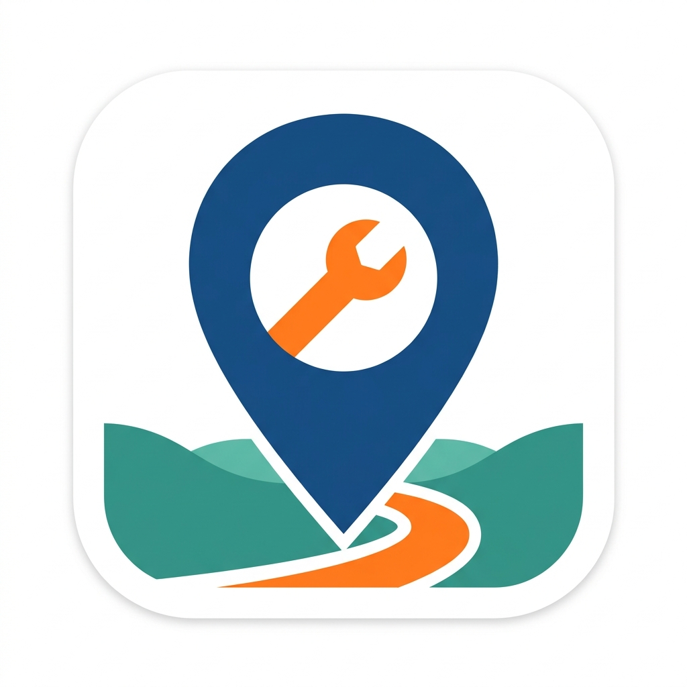

<p align="center"></p>

# FixBurgh

Snap, pin and route local infrastructure problems anywhere in Allegheny County,
Pennsylvania. FixBurgh tells residents exactly which office fixes a pothole,
landslide, dark streetlight or blocked drain: PennDOT, Allegheny County or one
of the county's 130 municipalities.

- Business requirements: [BRD/FixBurgh_BRD.md](BRD/FixBurgh_BRD.md)
- Data sources: [docs/data-sources.md](docs/data-sources.md)

**FixBurgh is not an emergency service. Call 911 for emergencies.**

## Stack

Flutter (iOS + Android) · Firebase (Auth, Firestore, Storage, App Check,
Crashlytics) · Google Maps SDK · Riverpod · go_router · public GIS data from
Allegheny County and PennDOT.

## Project layout

```
lib/
  app/            app shell: bootstrap, flavors, router, theme, Firebase options
  features/
    auth/         guest, Google and email sign-in (guest upgrade keeps reports)
    onboarding/   welcome and neutral 13+ age screen
    routing/      smart routing engine (pure Dart), municipality lookup
    map/ report/ my_reports/ profile/
  l10n/           strings (ARB); generated code in l10n/gen
assets/gis/       bundled boundaries and road ownership (built by tools/gis)
tools/gis/        script that downloads and simplifies the GIS data
BRD/  Images/     requirements document and all images
```

## Getting started

Requirements: Flutter 3.41+, Xcode 26+ with CocoaPods, and Android Studio
(Android SDK) for Android builds.

```bash
flutter pub get
flutter test
```

Run a flavor (each uses its own Firebase project):

```bash
flutter run --flavor dev -t lib/main_dev.dart
flutter run --flavor prod -t lib/main_prod.dart
```

| Flavor | App ID | Firebase project |
|---|---|---|
| dev | `com.fixburgh.app.dev` | `fixburgh-dev` |
| prod | `com.fixburgh.app` | `fixburgh-prod` |

Debug builds use the App Check debug provider. The first run prints a debug
token in the device log; add it in the Firebase console under App Check >
Apps > Manage debug tokens before App Check enforcement is turned on.

The Firebase config files in this repo (`firebase_options_*.dart`,
`GoogleService-Info.plist`, `google-services.json`) identify the projects and
are meant to be public. Access is protected by Security Rules, App Check and
API key restrictions. Never commit service-account keys or other secrets.

## Updating GIS data

```bash
python3 tools/gis/build_gis_assets.py
```

## License

[MIT](LICENSE)
